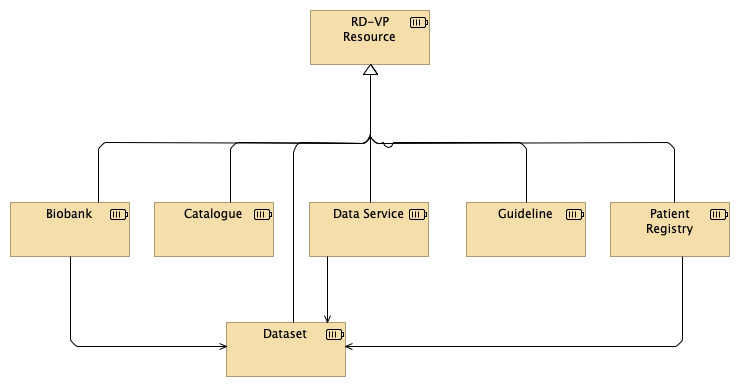
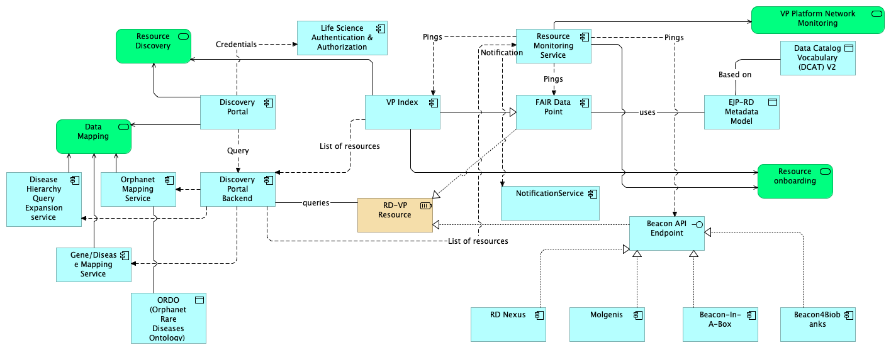

# RD-VP Architecture
In this repository we publish the architecture design of the Rare Diseases Virtual Platform (RD-VP).

The RD-VP aims at connecting different types of relevant resources to the rare diseases community. As depicted in the following figure, these resources can be biobanks, catalogues, data services, guidelines and patient registries. Biobanks and patient registries often contribute their datasets. 

If a resource owner/controller would like to offer it as part of the RD-VP, the metadata describing the resource should be made available. As depicted in the following figure, the resource provides its metadata through a [FAIR Data Point (FDP)](https://github.com/FAIRDataTeam/FAIRDataPoint). This metadata conforms to one of the RD-VP Metadata Schemas (i.e., metadata schemas for biobanks, catalogues, dataset, data services, guidelines and patient registries). These metadata schemas are based on the [W3C's Data Catalogue Vocabulary (DCAT)](https://www.w3.org/TR/vocab-dcat-2/).
Once the resource's metadata if provided, it is indexed by the [RD-VP's Index](https://index.vp.ejprarediseases.org), which lists all the resources available to the rare diseases community.

The metadata in the RD-VP is encoded in a technical language, RDF, which should be used primarily by applications. Therefore, applications and services developers can make use of the semanticaly-rich metadata. However, the language is not very readable for people without this specific technical knowledge. In order to facilitate the use by non-technical people, and to demonstrate how applications can be develop to add value to the rare diseases community, we have also developed the [RD-VP's Portal](https://vp.erdera.org), which offers services such as the listing (in a human-friendly way) of the RD-VP's available resources and, querying on the ones that implemented the querying service.
